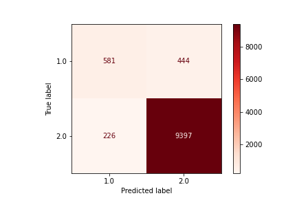

# Capstone Proposal

## Overview
### Background
ADHD is a developmental disorder associated with an ongoing pattern of inattention, hyperactivity, and/or impulsivity.
The symptoms of ADHD can interfere significantly with an individual’s daily activities and relationships.
ADHD symptoms begin in childhood and worsen in the teen years and adulthood.

People with ADHD experience an ongoing pattern of the following types of symptoms:

- Inattention–having difficulty paying attention
- Hyperactivity–having too much energy or moving and talking too much
- Impulsivity–acting without thinking or having difficulty with self-control

Some people with ADHD mainly have symptoms of inattention. Others mostly have symptoms of hyperactivity-impulsivity.
Some people have both types of symptoms.

ADHD comes in many forms and severities, and teenagers and adults who are undiagnosed often don't even consider they may
have ADHD.

### Data
The NSCH is a household survey that produces national and state-level data on the physical and emotional health of
children 0 - 17 years old in the United States. Since 2016, the NSCH has been an annual survey. The survey supports national estimates every year and state-level
estimates by combining 2 or 3 years of data. In this project I would primarily look at the 2020 data.

The survey collects information related to the health and well-being of
children, including access to and use of health care, family interactions, parental health, school and after-school
experiences, and neighborhood characteristics. A parent or other adult caregiver with knowledge of the sampled child’s health and health care filled out the topical
questionnaire.

Survey topics include:
- Child and family characteristics
- **Physical and mental health status, including current conditions and functional difficulties**
- Health insurance status, type, and adequacy
- Access and use of health care services
- Medical, dental, and specialty care needed and received
- Family health and activities
- Impact of child’s health on family
- Neighborhood characteristics

Data sourced from the [National Survey of Children's Health](https://www.census.gov/programs-surveys/nsch/data/datasets.html) obtained by the United States Census Bureau

### Goal
In the NSCH data is a question that asks:
- Has a doctor or other health care provider EVER told you that this child has…
   Attention Deficit Disorder or Attention-Deficit/Hyperactivity Disorder, that is, ADD or ADHD?

For this project I would like to
Create a model that can return the probability that a child from the survey has ADHD, **but is undiagnosed**.

To achieve this, I would train the model on kids from the survey who **have** been diagnosed with ADHD. Then I would have
the model predict the probability that a child has ADHD on kids from the survey who **have not** been diagnosed with ADHD.

The idea here being, that if the model finds many similarities between a child who **has not** been diagnosed, and the
children who **have been** diagnosed, then that child may have undiagnosed ADHD.

The kids who the model flagged as having a high chance of undiagnosed ADHD would then have an email sent to their
primary caregiver that explains that their child shows many similarities with those who have been diagnosed with ADHD.
Resources for ADHD and recommendations on next steps could be included in the email as well.

One distinction I'd like to make: **This project is not about diagnosing kids with ADHD**.

 ADHD can express itself in many different forms. Parents  may not even consider the
possibility that their child has ADHD (Especially if the child has
[ADHD-I](https://en.wikipedia.org/wiki/Attention_deficit_hyperactivity_disorder_predominantly_inattentive) or
 [ADHD-C](https://www.hopkinsmedicine.org/health/conditions-and-diseases/adhdadd)).
 So my goal here is spread awareness, and plant the idea that the child may have ADHD, so that even if they don't go to
 a doctor immediately, that idea has been planted.

***

## Model
I performed some preliminary [data exploration](https://github.com/austint1121/Capstone_Proposal/blob/main/Notebooks/Exploratory.ipynb)
and [created a simple model](https://github.com/austint1121/Capstone_Proposal/blob/main/Notebooks/Modeling.ipynb)
to check the plausibility of the project.

I used [catboost](https://catboost.ai/en/docs/) to create a baseline model, since it is capable of handing categorical data, and
also is able to model on data with minimal cleaning. I ran the model on the entire dataset, which had 42,777 rows and 443 columns.

(Note a modeless baseline would have an accuracy of 92%)
- Accuracy:
  - 93.7%
- Precision:
  - 72.0%
- Recall:
  - 56.7%
- F1
  - 63.4%
- Roc/Auc
  - 77.2%

### Feature Importance

Using Catboost's [get_feature_importance](https://catboost.ai/en/concepts/fstr) method I investigated the top 10 features
of the resulting model.

1. **SC_CSHCN** = Special Health Care Needs Status of Selected Child

2.  **FORMTYPE** = Administrative variable, and index column

3.  **MENBEVCOV** - Health Insurance - Thinking specifically about this child's mental or behavioral health needs, how often does this child's health insurance offer benefits or cover services that meet these needs?

4. **TELLSTORY** - Is this child able to do the following:
  Tell a story with a beginning, middle, and end?
  

5.  **MEMORYCOND** - Does this child have serious difficulty concentrating, remembering, or making decisions because of a physical, mental, or emotional condition

6.  **K2Q34A** = Has a doctor, other health care provider, or educator EVER told you that this child
  has Behavioral or Conduct Problems?
 

7.  **SC_SEX** = Sex of child in question

8. **SESPLANYR** is a Subquestion of
    - K6Q15: Has this child EVER had a special education or early intervention plan?"
        - 'SESPLANYR' : "How old was the child at the time of the FIRST plan?"

9. **TOTCSHCN** = Count of Children with Special Health Care Needs in Household

10.  **K7Q84_R** = How often does this child work to finish tasks they start?

The full variable list can be found [here](https://www2.census.gov/programs-surveys/nsch/technical-documentation/codebook/2020-NSCH-Topical-Variable-List.pdf)

## Information

Full data exploration notebook can be found [here](https://github.com/austint1121/Capstone_Proposal/blob/main/Notebooks/Exploratory.ipynb)
 
First model notebook can be found [here](https://github.com/austint1121/Capstone_Proposal/blob/main/Notebooks/Modeling.ipynb)
